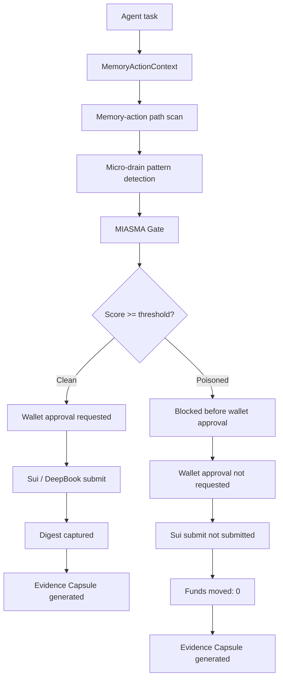

<div align="center">

# MIASMA

### Pre-execution memory-action quarantine for agentic Sui actions

Small actions became a micro-drain pattern.  
MIASMA blocked the sequence before wallet approval.  
**Funds moved: 0.**


</div>

## Five-second incident block

```txt
Small actions became a micro-drain pattern.
MIASMA blocked the sequence before wallet approval.
Funds moved: 0.
```

## Incident summary

| Field | Value |
|---|---|
| Agent action | DeepBook / Sui micro-action sequence |
| Pattern | 5 USDC × 10 attempts |
| Projected movement | 50 USDC |
| Contamination score | 87 |
| Quarantine threshold | 70 |
| Decision | BLOCKED |
| Wallet approval | Not requested |
| Sui submit | Not submitted |
| Transaction digest | None — blocked before execution |
| Funds moved | 0 |

## Problem

AI agents are beginning to act on-chain.  
Wallets show what will be signed.  
Policies can limit budgets or protocols.  
But neither proves whether the memory that caused the action was poisoned.  
A small action can look harmless.  
A sequence of small actions can become a micro-drain.

## Solution

MIASMA verifies the memory-action path before wallet approval.  
If the path is poisoned, MIASMA blocks the sequence, generates proof, creates an evidence capsule, and prevents wallet approval and Sui submit.

## Blocked vs clean

| Step | Poisoned micro-drain sequence | Clean test action |
|---|---|---|
| Agent creates draft | Yes | Yes |
| Memory-action path scan | Yes | Yes |
| Contamination score | 87 | Low |
| Threshold | 70 | 70 |
| Decision | BLOCKED | ALLOW |
| Wallet approval | Not requested | Requested |
| User signature | Not requested | User approves |
| Sui submit | Not submitted | Submitted |
| Transaction digest | None | Captured |
| Evidence Capsule | Generated | Generated |
| Funds moved | 0 | Only after clean approval |

## Mermaid product flow



## What Works Today

| Surface | Status |
|---|---|
| Local Rust verifier | Working |
| Poisoned / clean fixtures | Working |
| Quarantine decision semantics | Working |
| Evidence Capsule generation | Working |
| Sui QuarantineReceipt module | Move build passing |
| Groth16 prove / verify | Live locally |
| Skill firewall | Wired |
| Wallet approval gating | Wired |

## Production Truth

| Surface | Status |
|---|---|
| Blocked poisoned action digest | None, because it is never submitted |
| Walrus upload | Only real when configured |
| Seal encryption | Only real when configured |
| Sui anchor | Only real when configured |
| Nitro / TEE verification | Only real in actual Nitro runtime |
| Mainnet claims | Not claimed |

## Commands

```bash
npm run check:core
npm run evidence:capsule
npm run zk:verify
npm run build
```

Optional scripts, with caveats:

- `npm run tee:verify` - real Nitro / TEE verifier, requires a real attestation document
- `npm run evidence:seal` - real Seal gate, requires config
- `npm run evidence:walrus` - real Walrus gate, requires config
- `npm run evidence:anchor` - real Sui capsule anchor gate, requires config
- `npm run move:build` - Move build for the receipt module

## Commercial Path

| Customer | Product surface | Revenue path |
|---|---|---|
| Agent apps | Protected action scan API / SDK | Per protected action |
| Protocols | Pre-execution integration before Move calls / DeFi actions | Integration + volume |
| Teams | Workspace console / incident archive / audit trail | Subscription |
| Evidence users | Capsule verification / encrypted artifact access | Per verification / access |
| Sui ecosystem | Safer autonomous Sui activity | More trusted agent usage |

## Built through Sui

MIASMA is the result of a year of learning with Sui.

After Sui Overflow 2025, I spent the year learning, building, and participating across the Sui Japan ecosystem.

Through the Build on Sui: Move Workshop Series, community events, builder sessions, and Sui x ONE Samurai Tokyo Builders' Arena, I learned not only the technology, but also the people, culture, and direction of Sui.

I also kept building across AI and Web3 hackathons, receiving three awards along the way.

MIASMA is my answer to what Sui will need next:
a pre-execution memory-action boundary for the agentic Sui era.

Thank you to the Sui community.
I will keep building.

## Final line

Agents can act.  
MIASMA verifies why they act before funds move.  
Funds moved: 0.

