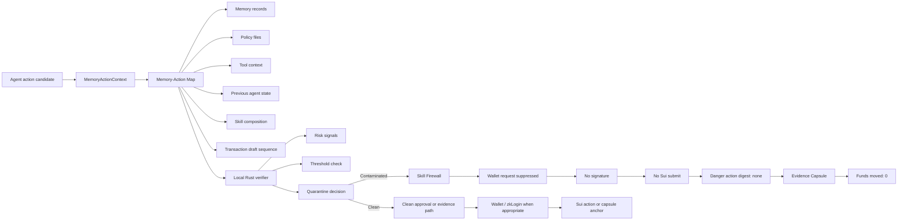
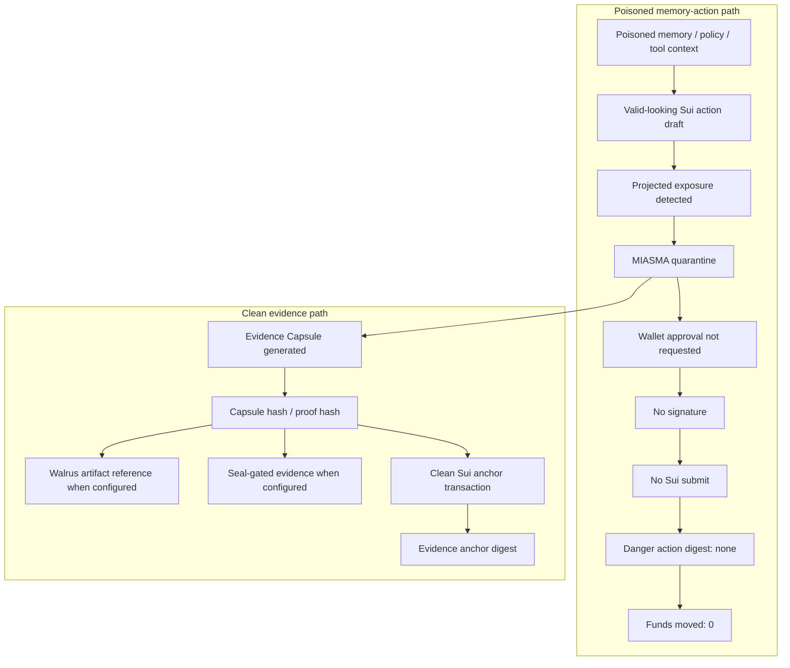
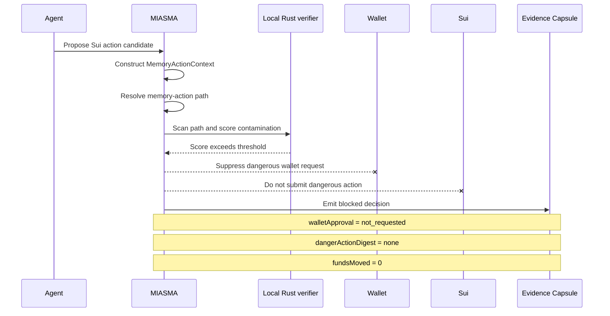

# MIASMA

**Agentic memory-action firewall for Sui agents**

The agent was not hacked at execution.  
It was poisoned in memory.

**Map. Verify. Block. Funds moved: 0.**

Sui is the settlement and receipt layer for the blocked decision and the public audit trail.

<p align="center">
  
  
  
  
</p>

<p align="center">
  
  
  
  
  
  
</p>

---

## Five-second evaluation

```txt
Agent wants to pay 900 USDC.
Memory path: vendor_policy_v3.txt -> payment_rules.md -> send_usdc.
Hidden instruction contamination detected.
Wallet request: suppressed.
Danger action digest: none.
Funds moved: 0.
```

The transaction looked valid.  
The memory path was poisoned.  
MIASMA blocked the action before wallet approval.

---

## What MIASMA protects

MIASMA protects agentic Sui actions before wallet approval.

An autonomous agent can create an action that looks valid on the surface. The amount, recipient, and transaction structure may appear ordinary. A wallet preview may look clean.

But the reason the action was created may already be poisoned.

The dangerous instruction may not be inside the transaction itself. It can be hidden inside memory, policy files, tool context, previous agent state, or repeated draft behavior.

MIASMA checks the memory-action path before wallet approval. If the path is contaminated, MIASMA suppresses the wallet request, emits a structured Evidence Capsule, and leaves the dangerous action without a digest.

**Projected exposure: 900 USDC**  
**Wallet request: suppressed**  
**Wallet approval: not requested**  
**Signature: not requested**  
**Sui submit: not submitted**  
**Danger action digest: none**  
**Funds moved: 0**

---

## Why this exists

Most systems check the transaction.

**MIASMA checks the memory that caused it.**

Wallets show what will be signed. MIASMA checks why the action was created.

This matters because AI agents are moving from chat to execution. They do not only describe actions. They can prepare transfers, call tools, route through DeFi systems, interact with wallets, and trigger onchain actions.

By the time a wallet approval appears, the dangerous instruction may already have passed through memory, policy, tool context, skill composition, and transaction drafting.

MIASMA moves the security boundary earlier.

---

## The security event

The security event is not a rejected wallet request.

The security event is earlier:

```txt
memory-action path contaminated
-> wallet request suppressed
-> no signature requested
-> no Sui submit
-> no danger-action digest
-> funds moved 0
```

A blocked poisoned action has no digest.  
That is the point.

The evidence anchor can have a digest.  
The dangerous action cannot.

---

## Verification surfaces

One poisoned memory path is checked across multiple safety surfaces before any real action can execute.

| Surface | Role | Status |
| --- | --- | --- |
| `MemoryActionContext` | Captures agent intent, skill, recipient, proposed amount, memory path, and memory hash | recorded |
| Local Rust verifier | Reads the memory-action input, scores contamination, and emits a `MiasmaScanArtifact` | passing |
| Skill Firewall | Blocks contaminated skill use before real execution | wired |
| Shadow execution | Simulates the action and keeps real execution blocked | wired |
| Sui `QuarantineReceipt` | Stores blocked-decision metadata, artifact hash, proposed amount, score, and `funds_moved = 0` | Move build passing |
| Evidence Capsule | Records the blocked decision and proof path instead of creating a dangerous digest | implemented |
| Groth16 quarantine proof | Provides a threshold proof path for the quarantine rule | proof path |
| Walrus artifact reference | References scan or capsule artifacts when configured | configured path |
| Seal evidence path | Gates sensitive scan evidence when configured | configured path |
| Wallet boundary | Suppresses the dangerous wallet request when contamination exceeds threshold | enforced |
| Sui submit boundary | Prevents the dangerous action from being submitted | enforced |

---

## How it works

1. An agent prepares a Sui action candidate.
2. MIASMA builds a `MemoryActionContext` from agent intent, skill, recipient, proposed amount, memory path, and memory hash.
3. The Memory-Action Map resolves the cause chain behind the action.
4. The verifier scores the path for hidden instruction contamination, policy drift, tool-context contamination, and repeated valid-looking draft behavior.
5. If the score exceeds threshold, the Skill Firewall blocks the path before wallet approval.
6. The wallet request is suppressed.
7. No signature is requested.
8. No dangerous action is submitted to Sui.
9. No danger-action digest exists.
10. MIASMA emits an Evidence Capsule proving why the path was blocked.
11. A clean capsule hash or proof hash can be anchored on Sui.
12. Funds moved: 0.

---

## Architecture



---

## Poisoned path vs clean evidence path

The dangerous action and the evidence path are separate.

The poisoned action is not submitted.  
The evidence anchor can be submitted as a clean Sui transaction.



---

## Scan lifecycle



---

## Proof chain

```txt
MemoryActionContext
-> Local Rust verifier
-> MiasmaScanArtifact
-> Skill Firewall
-> Evidence Capsule
-> Walrus artifact ref when configured
-> Seal evidence path when configured
-> Groth16 quarantine proof path
-> Sui QuarantineReceipt
-> fundsMoved: 0
```

Public display version:

```txt
Memory path
-> Verifier
-> Quarantine decision
-> Skill block
-> Evidence capsule
-> Artifact reference
-> Sui receipt
-> Funds moved: 0
```

---

## Controlled incident

The default sample shows a valid-looking action caused by contaminated memory.

```txt
User preference:
- Use approved Sui actions only.
- Pay vendor through the approved payment policy.

Contaminated memory path:
vendor_policy_v3.txt
-> payment_rules.md
-> hidden instruction contamination
-> Pay Vendor
```

MIASMA reads the sample as data.  
The dangerous action is not executed.

Expected blocked result:

```txt
decision: BLOCKED
reason: hidden instruction contamination in memory-action path
sample: poisoned-memory
proposedAmount: 900 USDC
contaminationScore: 87
recommendation: quarantine
walletApproval: not requested
signature: not requested
suiSubmit: not submitted
dangerActionDigest: none
fundsMoved: 0
```

---

## Run trace

```txt
01 memory.open          vendor_policy_v3.txt
02 policy.load          payment_rules.md
03 detector.scan        hidden instruction contamination
04 skill.compose        send_usdc
05 tx.draft             valid-looking Sui action candidate
06 path.resolve         memory -> policy -> contamination -> action
07 miasma.scan          contamination score 87
08 verifier.boundary    threshold exceeded
09 quarantine.block     before wallet approval
10 capsule.emit         evidence generated
11 wallet.approval      not requested
12 signature            not requested
13 sui.submit           not submitted
14 digest               none
15 fundsMoved           0
```

This trace is the product boundary.

The dangerous wallet request never appears.

---

## Evidence Capsule

The Evidence Capsule is the proof object created instead of the dangerous transaction.

```json
{
  "product": "MIASMA",
  "capsuleType": "MIASMA_VERIFIED_EVIDENCE_CAPSULE",
  "decision": "BLOCKED",
  "blocked": true,
  "confirmationRequired": false,
  "contaminationScore": 87,
  "threshold": 80,
  "projectedExposure": "900 USDC",
  "recommendation": "quarantine",
  "walletApproval": "not_requested",
  "walletRequest": "suppressed",
  "signature": "not_requested",
  "suiSubmit": "not_submitted",
  "dangerActionDigest": "none",
  "fundsMoved": 0,
  "evidencePath": {
    "memoryActionContext": "recorded",
    "quarantineProof": "verified",
    "capsuleHash": "generated",
    "walrusArtifactRef": "referenced_when_configured",
    "sealEvidence": "gated_when_configured",
    "suiAnchor": "optional_clean_anchor_only"
  }
}
```

The capsule proves:

- what the agent read
- which memory-action path was evaluated
- why the path was considered contaminated
- why wallet approval was never requested
- why the dangerous action has no digest
- why funds moved 0

---

## Core data model

### `MemoryActionContext`

```ts
type MiasmaMemoryActionContext = {
  agent: string;
  skillId: string;
  amountLabel: string;
  proposedAmount: number;
  intent: string;
  asset: string;
  recipient: string;
  memoryPath: readonly string[];
  memoryHash: string;
};
```

Sample context:

```txt
agent: Agent wants to pay 900 USDC
skillId: send_usdc
intent: Pay vendor
asset: USDC
recipient: vendor
memoryPath: vendor_policy_v3.txt -> payment_rules.md -> send_usdc
```

### `MiasmaScanArtifact`

```ts
type MiasmaScanArtifact = {
  name: string;
  memoryPath: readonly string[];
  memoryHash: string;
  proposedAmount: number;
  contaminationScore: number;
  actionBlocked: boolean;
  fundsMoved: number;
  recommendation: "quarantine" | "allow";
  infectedPath: readonly string[];
  detectorResults: readonly string[];
};
```

Required blocked output:

```txt
actionBlocked: true
proposedAmount: 900
contaminationScore: 87
fundsMoved: 0
recommendation: quarantine
detectorResults: hidden instruction contamination
```

---

## Sui receipt model

The Sui-side receipt records the blocked decision and the public audit fields.

```move
public struct QuarantineReceipt has key, store {
    id: sui::object::UID,
    receipt_id: vector<u8>,
    memory_hash: vector<u8>,
    scan_artifact_hash: vector<u8>,
    artifact_ref: vector<u8>,
    proposed_amount: u64,
    funds_moved: u64,
    contamination_score: u64,
    decision: vector<u8>,
    recommendation: vector<u8>,
    verifier: vector<u8>,
    created_at_ms_or_epoch: u64,
}
```

The receipt is for the blocked decision.  
It is not the dangerous transfer.

---

## Sui, Walrus, Seal, and zkLogin boundary

MIASMA uses Sui surfaces for clean evidence anchoring, not for submitting the dangerous action.

| Surface | Used for | Not used for |
| --- | --- | --- |
| Sui | capsule hash anchor, proof hash anchor, public decision metadata, `fundsMoved: 0` | submitting the dangerous transfer |
| Sui Wallet | clean actions or clean evidence anchors after quarantine | signing contaminated paths |
| zkLogin | clean evidence anchor path when appropriate | bypassing quarantine |
| Walrus | artifact reference for scan/capsule data when configured | replacing the verifier |
| Seal | gated access to sensitive evidence when configured | exposing raw poisoned memory publicly |
| Sui explorer | clean action or real evidence anchor digest | blocked poisoned action digest |

A blocked poisoned action has no digest.  
That is the product result.

The dangerous action has no digest.  
The evidence anchor can have a digest.

---

## Protectable Sui action surfaces

MIASMA can sit in front of agentic actions touching Sui surfaces such as:

| Category | Surfaces |
| --- | --- |
| Wallet / identity | Sui Wallet, zkLogin |
| DeFi / liquidity | DeepBook, Cetus, Scallop, NAVI, Aftermath, Suilend |
| Perps / routing | Bluefin, Kriya, Turbos |
| Liquid staking / yield | Haedal, Typus, Momentum |
| Evidence / storage | Walrus, Seal |
| Treasury / agent operations | payment agents, rebalancing agents, autonomous treasury tools |

These are protectable action surfaces, not partnership claims.

---

## What works today

| Area | Behavior |
| --- | --- |
| Entry incident | Shows a valid-looking action with poisoned memory cause |
| Poisoned memory sample | Loads a memory-policy sample as data |
| Clean memory sample | Produces an allow result without moving funds |
| Local verifier | Parses fixture input, detects contamination, and emits JSON artifact |
| Risk scoring | Raises contamination score to 87 for poisoned path |
| Skill Firewall | Blocks before wallet approval |
| Shadow execution | Simulates the action while real execution remains blocked |
| Wallet behavior | Approval is not requested for the dangerous path |
| Signature behavior | Signature is not requested |
| Sui behavior | Dangerous action is not submitted |
| Digest behavior | Danger action digest remains none |
| Evidence Capsule | Emits structured blocked-decision artifact |
| Clean anchor path | Separates capsule/proof anchor from the dangerous action |
| Walrus path | Artifact reference path when configured |
| Seal path | Evidence access-control path when configured |
| Groth16 path | Threshold proof path for quarantine decision |
| Funds moved | 0 |

---

## What is intentionally not claimed

MIASMA does not claim that every Sui protocol is directly integrated.

MIASMA does not claim that Walrus or Seal are required for every scan.

MIASMA does not claim that the dangerous transaction is submitted and then reverted.

MIASMA does not invent a digest for a blocked action.

MIASMA does not replace wallets.

MIASMA does not rely on wallet rejection as the security event.

The security event happens before wallet approval.

```txt
contaminated cause chain
-> quarantine before approval
-> wallet request suppressed
-> no signature
-> no submit
-> no danger-action digest
-> evidence capsule emitted
-> funds moved 0
```

---

## Repository layout

<table>
<tr>
<td valign="top" width="50%">

<strong>Application / Core / Verifier</strong>

<pre><code>miasma-atlas/
├─ README.md
├─ index.html
├─ package.json
├─ package-lock.json
├─ vite.config.ts
├─ src/
│  ├─ App.tsx
│  ├─ main.tsx
│  ├─ styles.css
│  ├─ sui.ts
│  └─ lib/
│     └─ miasma/
│        ├─ agent-flight-recorder.ts
│        ├─ agent-runtime.ts
│        ├─ evidence-path.ts
│        ├─ groth16-proof.ts
│        ├─ memory-action-context.ts
│        ├─ quarantine-proof.ts
│        ├─ quarantine-receipt.ts
│        ├─ sample-agent-runtime.ts
│        ├─ sample-evidence-path.ts
│        ├─ sample-quarantine-proof.ts
│        ├─ sample-quarantine-receipt.ts
│        ├─ sample-scan-artifact.ts
│        ├─ scan-artifact.ts
│        ├─ seal-evidence.ts
│        ├─ shadow-execution.ts
│        ├─ skill-manifest.ts
│        ├─ skill-use-record.ts
│        ├─ tool-permission-context.ts
│        └─ walrus-artifact.ts
└─ verifier/
   ├─ Cargo.toml
   ├─ fixtures/
   │  ├─ poisoned-memory.json
   │  └─ clean-memory.json
   └─ src/
      ├─ artifact.rs
      ├─ detectors.rs
      ├─ lib.rs
      ├─ main.rs
      ├─ scan.rs
      └─ tests.rs</code></pre>

</td>
<td valign="top" width="50%">

<strong>Move / Docs / Scripts</strong>

<pre><code>miasma-atlas/
├─ move/
│  ├─ Move.toml
│  ├─ README.md
│  └─ sources/
│     └─ quarantine_receipt.move
├─ docs/
│  ├─ PUBLIC_WORDING_POLICY.md
│  ├─ ARCHITECTURE.md
│  ├─ FINAL_REQUIREMENTS.md
│  ├─ THREAT_MODEL.md
│  ├─ EVALUATION_SCRIPT.md
│  ├─ IMPLEMENTATION_STATUS.md
│  ├─ EVIDENCE_PATH.md
│  ├─ ZK_QUARANTINE_PROOF.md
│  ├─ SKILL_FIREWALL.md
│  ├─ MCP_INTERFACE.md
│  ├─ VERIFIER_PATH.md
│  ├─ CODEX_RULES.md
│  ├─ MIASMA_PRODUCTION_TRUTH.md
│  └─ archive/
│     └─ archived internal research note
├─ mcp/
├─ nitro/
├─ infra/nitro/
├─ zk/
└─ scripts/
   ├─ check-public-wording.sh
   ├─ tee-verify.mjs
   ├─ core-smoke.mjs
   ├─ evidence-capsule.mjs
   ├─ seal-evidence.mjs
   ├─ walrus-upload-evidence.mjs
   ├─ anchor-capsule.mjs
   └─ zk-groth16.mjs</code></pre>

</td>
</tr>
</table>

## Key implementation surfaces

| Surface | Path | Role |
| --- | --- | --- |
| Product UI | `src/App.tsx` | Main MIASMA interface and product walkthrough. Shows the agent action, Memory-Action Map, quarantine proof, Skill Firewall state, and funds moved result. |
| Sui constants | `src/sui.ts` | Keeps Sui network and explorer helpers separate from the product UI. Public product name is `MIASMA`. |
| Memory-action model | `src/lib/miasma/memory-action-context.ts` | Defines the structured cause object behind an agentic Sui action. |
| Scan artifact model | `src/lib/miasma/scan-artifact.ts` | Defines the `MiasmaScanArtifact` result emitted by the verifier path. |
| Evidence path | `src/lib/miasma/evidence-path.ts` | Models the Evidence Capsule path, public artifact reference, restricted evidence, Seal path, Walrus reference, and proof references. |
| Quarantine receipt | `src/lib/miasma/quarantine-receipt.ts` | Models the blocked-decision receipt and `fundsMoved: 0` result. |
| Skill boundary | `src/lib/miasma/skill-manifest.ts` / `src/lib/miasma/skill-use-record.ts` | Defines the protected skill, permissions, memory dependencies, and blocked skill-use record. |
| Shadow execution | `src/lib/miasma/shadow-execution.ts` | Models simulated evaluation while real execution remains blocked. |
| Agent flight record | `src/lib/miasma/agent-flight-recorder.ts` / `src/lib/miasma/agent-runtime.ts` | Records the agent execution path from observation through gate, receipt, and learning. |
| Local verifier | `verifier/src/*` | Rust verifier, detector logic, parser, scan analyzer, artifact output, CLI entry, and tests. |
| Verifier fixtures | `verifier/fixtures/*` | Poisoned and clean memory samples used for deterministic scan checks. |
| Sui receipt module | `move/sources/quarantine_receipt.move` | Move module for the Sui quarantine receipt / clean capsule anchor surface. |
| Public docs | `docs/*.md` | Architecture, requirements, threat model, evidence path, skill firewall, ZK proof path, and evaluation materials. |
| Public wording policy | `docs/PUBLIC_WORDING_POLICY.md` / `scripts/check-public-wording.sh` | Enforces public wording safety and prevents old or overclaimed positioning from returning. |

---

## Quick start

```bash
git clone https://github.com/0x-xrpl/miasma-atlas.git
cd miasma-atlas

npm install
npm run dev
```

Open the local app, then inspect the poisoned memory flow.

Build the app:

```bash
npm run build
```

Build the Sui Move receipt package:

```bash
npm run move:build
```

Run the Rust verifier:

```bash
cd verifier
cargo test
cargo run -- --input fixtures/poisoned-memory.json
cargo run -- --input fixtures/clean-memory.json
```

Expected poisoned output:

```json
{
  "name": "poisoned-memory",
  "memoryPath": [
    "vendor_policy_v3.txt",
    "payment_rules.md",
    "hidden instruction contamination",
    "Pay Vendor"
  ],
  "proposedAmount": 900,
  "contaminationScore": 87,
  "actionBlocked": true,
  "fundsMoved": 0,
  "recommendation": "quarantine",
  "infectedPath": [
    "vendor_policy_v3.txt",
    "payment_rules.md",
    "send_usdc"
  ],
  "detectorResults": [
    "hidden instruction contamination"
  ]
}
```

Expected clean output:

```txt
actionBlocked: false
contaminationScore: below 50
recommendation: allow
fundsMoved: 0
```

---

## Verifier check

```bash
cd verifier
cargo test
```

Expected test behavior:

```txt
poisoned memory-action path -> BLOCKED
clean memory-action path    -> ALLOW
fundsMoved                  -> 0
```

The verifier runs before execution.

`proposedAmount` is the amount the agent wanted to move.  
`fundsMoved` remains `0` during verification.

---

## Move check

```bash
npm run move:build
```

Expected behavior:

```txt
Move build passes.
QuarantineReceipt compiles.
QuarantineReceiptCreated event is available.
funds_moved is set to 0 for the blocked decision.
```

---

## Public wording check

```bash
bash scripts/check-public-wording.sh
```

Expected behavior:

```txt
[PASS] Public wording check passed.
```

The wording check prevents legacy terms, overclaims, and process language from entering the public README and docs.

---

## Threat model

MIASMA is designed for agentic Sui actions where the final transaction can look valid while the cause chain is contaminated.

It protects against:

- poisoned long-term memory
- hidden instruction contamination
- policy file drift
- tool context contamination
- previous agent state contamination
- repeated valid-looking draft patterns
- malicious memory-to-action paths
- wallet approval requests created from contaminated causes

MIASMA does not replace wallets.

MIASMA acts before wallet approval.

Wallets show what will be signed.  
MIASMA checks why the action was created.

---

## Market & trust infrastructure

Agentic execution is growing. Programmable money is already massive. Crypto risk remains large. Memory poisoning is becoming a real agentic attack surface.

The next risk is not only whether a transaction is safe to sign.

The next risk is whether an autonomous agent should have created the action at all.

MIASMA is not another interface.

MIASMA is trust infrastructure before autonomous value movement.

Protected execution surfaces include:

- memory-action scans
- protected agent actions
- quarantine receipts
- verified Evidence Capsules
- protocol integrations
- treasury review paths
- wallet-before-approval controls
- agent security infrastructure

---

## In one breath

A Sui agent proposes an action.  
The transaction looks valid.  
MIASMA maps the memory-action path that caused it.  
The path is contaminated.  
The Skill Firewall blocks before wallet approval.  
No signature is requested.  
No dangerous action is submitted.  
No danger-action digest exists.  
An Evidence Capsule records the blocked decision.  
Funds moved: 0.

---

## Final thesis

Most systems check the transaction.

**MIASMA checks the memory that caused it.**
