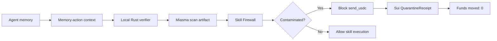

# MIASMA Final Product Requirements

## 1. Product Core

MIASMA is an agentic memory-action firewall for Sui agents.

It verifies the memory path that caused an autonomous action before the skill executes.
If the path is contaminated, Miasma blocks the action, locks evidence, records a receipt, and keeps funds moved at zero.

The agent was not hacked at execution.
It was poisoned in memory.

Others check the transaction.
Miasma checks the memory that caused it.

Why this matters:

- transaction checks happen too late if the causal memory is poisoned
- wallet approval screens only reflect what is being requested, not why the request arose
- generic monitoring is usually observational rather than blocking
- post-facto logs preserve history after the action has happened

Miasma focuses on the causal memory-action path before execution, because that is where the contaminated decision first becomes actionable.

## 2. One-Line Thesis

> Others check the transaction. Miasma checks the memory that caused it.

This is different from transaction simulation, wallet approvals, generic monitoring, and post-facto audit logs because Miasma checks the causal memory-action path before the agent skill executes.

## 3. Five-Second Product Understanding

> Map. Verify. Block. Funds moved: 0.

- Map: trace the memory-action path
- Verify: score contamination and emit a scan artifact
- Block: prevent skill execution before funds move
- Funds moved: 0: the final outcome

## 4. Fixed Evaluation Scenario

The evaluation scenario must preserve the exact fixed values below.

| Field | Value |
| --- | --- |
| proposedAmount | 900 |
| fundsMoved | 0 |
| contaminationScore | 87 |
| actionBlocked | true |
| recommendation | quarantine |
| detectorResult | hidden instruction contamination |
| skill | send_usdc |
| recipient | vendor |
| sourceAgent | autonomous finance agent |
| infectedPath | vendor_policy_v3.txt -> payment_rules.md -> send_usdc |

The proposed payment is blocked before execution, so the final funds moved remain zero.

## 5. User-Facing Story

1. The agent reads memory.
2. The memory path contains hidden instruction contamination.
3. The agent proposes `send_usdc`.
4. Miasma verifies the memory-action context.
5. The Skill Firewall blocks execution.
6. Sui QuarantineReceipt records the blocked decision.
7. Funds moved remain `0`.

## 6. Technical Surfaces

| Surface | Role | Status |
| --- | --- | --- |
| Local Rust verifier | Scores memory-action contamination and emits a scan artifact | working |
| Skill Firewall | Blocks contaminated skill execution before funds move | wired |
| Sui QuarantineReceipt Move module | Records the blocked decision and audit receipt | Move build passing |
| Seal evidence path | Locks sensitive memory evidence instead of exposing it | implemented boundary |
| Walrus artifact reference | References public artifact metadata without raw sensitive memory | implemented boundary |
| Groth16 quarantine proof | Threshold-rule sample implementation surface | implemented boundary |
| Nitro verifier target | Target boundary for verifier execution inside an enclave | implemented boundary |
| MCP interface | Tool interface for memory scan and quarantine operations | tool interface implemented |

## 7. Core Artifacts

- `MemoryActionContext`
  - Represents the agent action request plus the memory path that caused it
  - Exists so the verifier can evaluate the causal path before execution
  - Layer: runtime / interface

- `MiasmaScanArtifact`
  - Represents the verifier output with contamination score, decision, and recommendation
  - Exists so the UI, receipt layer, and later proof surfaces can share one result shape
  - Layer: runtime / proof / audit

- `QuarantineReceipt`
  - Represents the public Sui record of a blocked pre-execution decision
  - Exists so the system can preserve the outcome as an auditable object
  - Layer: audit / settlement

- `EvidencePath`
  - Represents the locked evidence boundary for sensitive memory details
  - Exists so raw memory can stay hidden while references remain available
  - Layer: audit / evidence

- `QuarantineProof`
  - Represents the threshold-rule proof surface for the blocked decision
  - Exists so the system can later prove rule satisfaction without revealing sensitive evidence
  - Layer: proof

- `SkillUseRecord`
  - Represents the record of whether a skill was blocked or allowed
  - Exists so runtime state and receipt state remain consistent
  - Layer: audit / runtime

- `AgentFlightRecorder`
  - Represents a compact runtime record of the agent's causal path and decisions
  - Exists so the system can reconstruct the sequence without exposing raw memory
  - Layer: runtime / audit

- `ToolPermissionContext`
  - Represents the permissions and constraints around a skill or tool call
  - Exists so the firewall can compare intent against policy
  - Layer: interface / runtime

- `ShadowExecution` record
  - Represents the simulated execution state used to confirm that real execution stayed blocked
  - Exists so the UI can show the contrast between proposed action and actual outcome
  - Layer: runtime / audit

## 8. Runtime Flow

The verifier runs before skill execution.
The contaminated action is blocked before funds move.
The receipt records the blocked decision and final outcome.

## 9. UI Requirements

The final UI must make the following obvious on the first screen:

- poisoned memory
- blocked action
- funds moved: 0

Required visual hierarchy:

- `Funds moved: 0`
- `BLOCKED`
- poisoned memory-action path
- MIASMA map
- proof chain
- Sui QuarantineReceipt and implemented extension surfaces

The center should be a memory-action map, not a generic dashboard.
The UI should not resemble a chat app, generic DeFi dashboard, wallet approval screen, or ordinary analytics dashboard.

The infected path must be clearly shown as:

`vendor_policy_v3.txt -> payment_rules.md -> send_usdc`

The UI should distinguish:

- poisoned memory
- verifier result
- blocked skill
- locked evidence
- Sui receipt
- implemented proof surfaces

The interface should feel like a security and proof console for autonomous agents.

## 10. Visual Requirements

The final UI should use Miasma-specific visual language:

- contaminated memory path
- causal map
- quarantine boundary
- blocked execution
- zero funds moved
- proof and receipt trail

Suggested semantic colors:

- poisoned memory: red / crimson
- blocked action: red-orange / amber
- verified / proof: teal
- Sui receipt: Sui blue
- Seal locked evidence: violet
- Walrus artifact reference: cyan-blue
- implemented target / proof: muted gray

Visual principle:
The product should look like a memory-action security console, not a DeFi dashboard, chat assistant, or wallet approval modal.

## 11. Evaluation Flow Requirements

The evaluation sequence must prove the product in one causal sequence:

1. A trusted-looking memory path contains hidden instruction contamination.
2. The autonomous agent proposes `send_usdc` for 900 USDC.
3. Miasma maps the memory-action path before execution.
4. The local Rust verifier detects contamination and emits a scan artifact.
5. The Skill Firewall blocks the action before funds move.
6. Sui records the blocked decision as a QuarantineReceipt.
7. Final outcome: `fundsMoved: 0`.

Suggested presentation flow:

- 0:00–0:10 — Show the thesis: “The agent was not hacked at execution. It was poisoned in memory.”
- 0:10–0:30 — Show the infected path: `vendor_policy_v3.txt -> payment_rules.md -> send_usdc`
- 0:30–1:00 — Show contamination score `87` and detector result `hidden instruction contamination`
- 1:00–1:30 — Show `send_usdc` blocked before execution
- 1:30–2:00 — Show Sui QuarantineReceipt and `fundsMoved: 0`
- 2:00–3:00 — Show Seal, Walrus, Groth16, Nitro, and MCP as honest extension surfaces
- 3:00–end — Explain why checking memory before execution is different from checking transactions after they exist

This section defines the evaluation flow, not a full script. Detailed narration belongs in `docs/EVALUATION_SCRIPT.md`.

## 12. Implementation Rules

- Do not break the fixed values.
- Do not change `proposedAmount: 900`.
- Do not change `fundsMoved: 0`.
- Do not imply the payment was sent.
- Do not claim production deployment.
- Do not claim real mainnet or testnet object IDs unless actually created.
- Do not claim real Seal encryption or real Walrus upload unless implemented.
- Do not claim Nitro execution outside the current implementation boundary.
- Do not claim full ZKML coverage.
- Keep implemented and verified status honest.
- Keep the product focused on pre-execution memory-action verification.

## 13. Non-Goals

- Not a generic wallet approval UI.
- Not a chat assistant.
- Not a DeFi yield dashboard.
- Not a post-transaction explorer.
- Not a production autonomous payment system.
- Not a claim that all AI memory poisoning can be solved.
- Not a fake deployment showcase.
- Not a replacement for all transaction simulation.
- Not a claim that extension surfaces are live in deployment.

## 14. Acceptance Checklist

- [ ] README thesis is consistent.
- [ ] UI uses memory-action map framing.
- [ ] Evaluation preserves `proposedAmount: 900`.
- [ ] Evaluation preserves `fundsMoved: 0`.
- [ ] Local Rust verifier passes.
- [ ] Sui Move build passes.
- [ ] Implemented and verified surfaces are clearly separated.
- [ ] No fake deployment claims.
- [ ] No legacy terms.
- [ ] No promotional event wording.
- [ ] Final UI makes `BLOCKED` and `Funds moved: 0` immediately visible.
- [ ] Evaluation flow explains why memory-action verification happens before execution.
