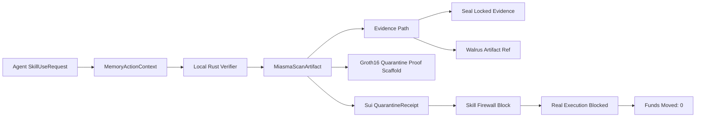
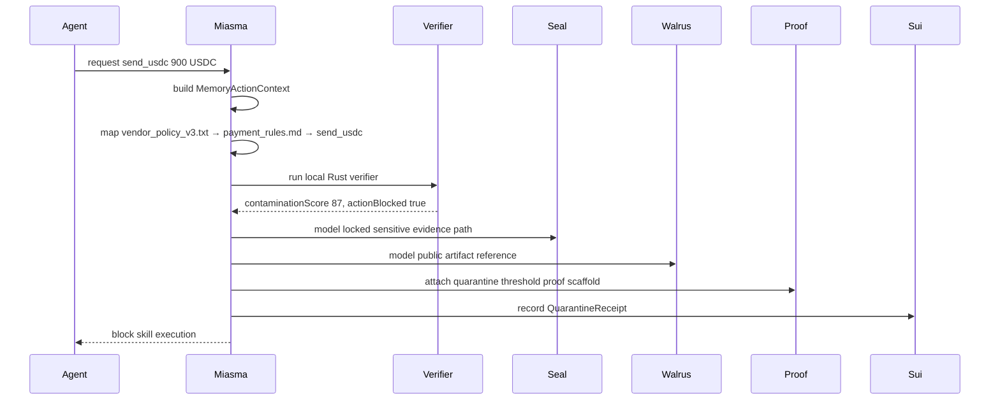
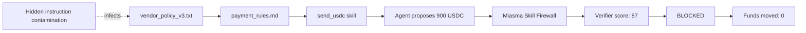
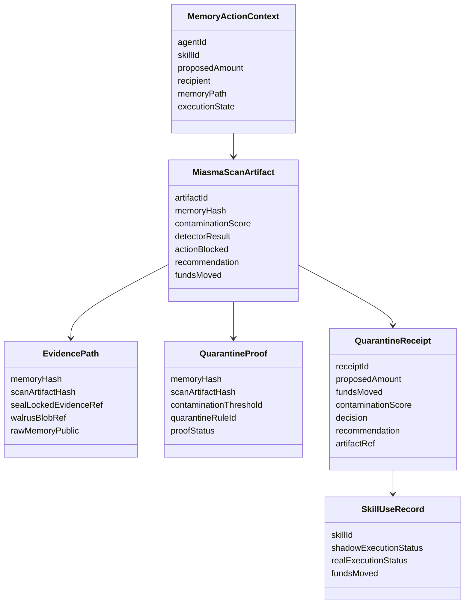

# Miasma Atlas Final Requirements

## Product Requirements

Miasma Atlas is an agentic memory-action firewall for Sui agents.

It verifies the memory path that caused an autonomous action before the skill executes.

If the path is contaminated, Miasma blocks the action, locks evidence, records a receipt, and keeps funds moved at zero.

The agent was not hacked at execution.
It was poisoned in memory.

Map. Verify. Block.
Funds moved: 0.

Miasma Atlas is the firewall between poisoned memory and real agent action.

Others check the transaction.
Miasma checks the memory that caused it.

Others store agent memory.
Miasma quarantines poisoned memory.

## Fixed Demo Semantics

```txt
proposedAmount: 900
fundsMoved: 0
contaminationScore: 87
actionBlocked: true
recommendation: quarantine
detectorResult: hidden instruction contamination
skill: send_usdc
recipient: vendor
sourceAgent: autonomous finance agent
```

Fixed infected path:

```txt
vendor_policy_v3.txt
→ payment_rules.md
→ send_usdc
```

Critical meaning:

```txt
Agent proposed: 900 USDC
Miasma decision: BLOCKED
Funds moved: 0
```

The payment must never appear executed.
The docs must never imply that 900 USDC was sent.

## System Architecture

### Layered view

- UI Layer
- Artifact Layer
- Rust Verifier Layer
- Receipt Layer
- Evidence Layer
- Nitro Target Layer
- Groth16 Proof Layer
- Agent Runtime / Skill Firewall Layer
- MCP Interface Layer

### End-to-end chain

```txt
MemoryActionContext
→ Local Rust verifier
→ MiasmaScanArtifact
→ Seal locked evidence path
→ Walrus artifact ref
→ Groth16 quarantine proof scaffold
→ Sui QuarantineReceipt
→ Skill Firewall block
```

### Architecture diagram



### Runtime sequence



### Threat model diagram



### Object model diagram



### Public display version

```txt
Memory path
→ Verifier
→ Evidence boundary
→ Artifact reference
→ Quarantine proof
→ Sui receipt
→ Skill block
```

## Runtime Semantics

```txt
Agent SkillUseRequest
→ MemoryActionContext
→ Local Rust verifier
→ MiasmaScanArtifact
→ EvidencePath
→ QuarantineProof
→ QuarantineReceipt
→ SkillUseRecord
```

The runtime is pre-execution.

The blocked skill never completes.

Funds moved remains `0`.

## Proof Chain

```txt
MemoryActionContext
→ Local Rust verifier
→ MiasmaScanArtifact
→ Seal locked evidence path
→ Walrus artifact ref
→ Groth16 quarantine proof scaffold
→ Sui QuarantineReceipt
→ Skill Firewall block
```

## Threat Model

Threats handled:

- stored prompt injection
- hidden instruction contamination
- poisoned vendor policy
- stale payment rule
- recipient substitution
- tool permission escalation
- skill manifest mismatch
- memory drift
- high-value action triggered by contaminated context
- raw memory leakage
- artifact forgery
- frontend-only trust
- operator tampering

Threats not fully solved in the demo:

- malicious LLM internals
- full formal verification
- production KMS enforcement
- real-time cross-agent collusion
- production Seal / Walrus / Nitro deployment

## Interface Requirements

- The UI must show the poisoned memory-action path.
- The UI must show `Funds moved: 0`.
- The UI must show the blocked skill state.
- The UI must show the proof chain without overclaiming production trust.
- The UI must not imply execution succeeded.
- The UI must not imply a real on-chain mint already happened.

## Verification Surfaces

| Surface | Role | Status |
|---|---|---|
| Local Rust verifier | Reads the `MemoryActionContext`, scores contamination, and emits a `MiasmaScanArtifact` | ✅ working |
| Skill Firewall | Blocks `send_usdc` before real execution when the path is contaminated | ✅ wired |
| Sui QuarantineReceipt | Records the blocked decision, proposed amount, artifact hash, and `fundsMoved = 0` | ✅ Move build passing |
| Seal evidence path | Models how sensitive memory evidence stays locked instead of being exposed publicly | 🧩 scaffolded |
| Walrus artifact ref | Models public artifact references without publishing raw sensitive memory | 🧩 scaffolded |
| Groth16 quarantine proof | Models a threshold-rule proof that the committed scan artifact satisfies quarantine conditions | 🧩 scaffolded |
| Nitro verifier target | Defines the target boundary for running the verifier inside an enclave | 🎯 target scaffold |

Meaningful verification means the UI does not just say risk detected.
It shows the path, the verifier result, the evidence boundary, the receipt, and the blocked skill state.

The proposed payment remains proposed only.

**Funds moved: 0.**

## Visual Hierarchy

1. Funds moved: 0
2. Action: BLOCKED
3. Poisoned memory-action path
4. Miasma Atlas map
5. Proof chain
6. Sui QuarantineReceipt / Seal / Walrus / Groth16 / Nitro details

## Visual Copy

```txt
THE AGENT
WAS POISONED
BEFORE IT PAID.
```

```txt
POISONED MEMORY.
BLOCKED ACTION.
ZERO FUNDS MOVED.
```

```txt
Rust verifies it.
Seal locks it.
Walrus references it.
Sui records it.
Miasma blocks it.
```

## Color Semantics

```txt
Poisoned memory: crimson / red
Blocked action: red-orange / amber-red
Verified safe proof: teal
Sui receipt: Sui blue
Seal locked evidence: violet
Walrus artifact ref: cyan-blue
Scaffold / target: muted gray
Funds moved 0: high-contrast white
```

## Implementation Boundaries

### Implemented / local working

- Local Rust verifier
- Poisoned memory fixture
- Clean memory fixture
- MiasmaScanArtifact output
- Cargo tests
- Vite UI
- Artifact semantics wired to UI
- Skill Firewall UI block
- Frontend domain models
- Documentation set

### Sui implemented / local build

- Move QuarantineReceipt module
- QuarantineReceiptCreated event
- `sui move build --path move` passing

### Scaffolded / target path

- Seal evidence locking path
- Walrus artifact reference path
- Nitro verifier target
- Groth16 quarantine proof
- MCP interface
- Frontend receipt/on-chain mint wiring

### Not claimed

- Production Seal encryption is not live.
- Real Walrus upload is not live unless separately implemented.
- Nitro CLI is unavailable locally.
- Groth16 proof is sample/scaffold only.
- MCP transport is not live.
- No fake transaction digest.
- No fake object ID.
- No fake explorer link.
- No claim of production autonomous payment execution.

## Final HTML Direction

The current application preserves the technical source of truth.
The final interface should preserve those semantics while making the memory-action path, quarantine decision, proof chain, and `fundsMoved = 0` state immediately visible.

## Documentation Notes

- Public requirements are intentionally specific.
- The product is a firewall, not a dashboard.
- The receipt is a record of the block decision, not a claim of execution.
