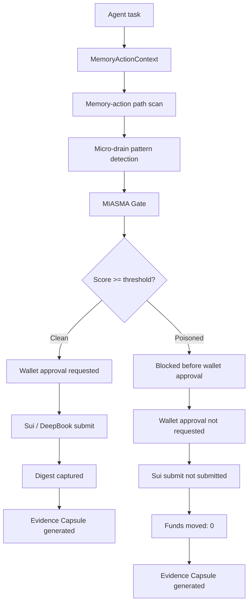
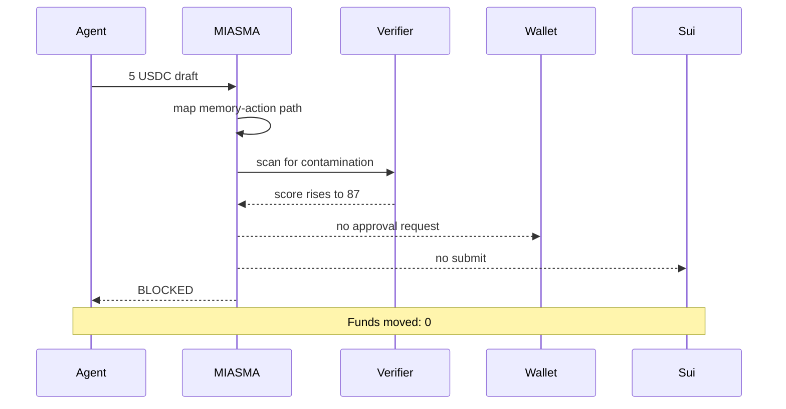

# MIASMA V3 Requirements

## Product Positioning

MIASMA is a pre-execution memory-action quarantine protocol for agentic Sui actions.

It blocks poisoned action sequences before wallet approval, generates evidence, and keeps `fundsMoved` at `0` for blocked actions.

## Primary Micro-Drain Incident

Small actions became a micro-drain pattern.

- 5 USDC × 10 attempted DeepBook / Sui action drafts
- Projected movement: 50 USDC
- MIASMA blocked the sequence before wallet approval
- Funds moved: 0

## Before-Wallet-Approval Semantics

MIASMA verifies the memory-action path before wallet approval.

If the path is poisoned:

- wallet approval is not requested
- Sui submit is not submitted
- transaction digest is none
- `fundsMoved` remains `0`

If the path is clean:

- wallet approval can be requested
- user signature can be collected
- Sui submit can be submitted
- transaction digest can be captured after submission

## Clean vs Poisoned Path

| Step | Poisoned micro-drain sequence | Clean test action |
|---|---|---|
| Agent creates draft | Yes | Yes |
| Memory-action path scan | Yes | Yes |
| Contamination score | 87 | Low |
| Threshold | 70 | 70 |
| Decision | BLOCKED | ALLOW |
| Wallet approval | Not requested | Requested |
| User signature | Not requested | User approves |
| Sui submit | Not submitted | Submitted |
| Transaction digest | None | Captured |
| Evidence Capsule | Generated | Generated |
| Funds moved | 0 | Only after clean approval |

## Evidence Capsule Fields

The Evidence Capsule records the blocked decision with a stable public chain of references.

Required fields:

- `capsuleId`
- `capsuleHash`
- `memoryHash`
- `policyHash`
- `contextHash`
- `memoryActionContextHash`
- `proofHash`
- `publicSignalsHash`
- `verificationState`
- `blocked`
- `confirmationRequired`
- `fundsMoved`
- `walrusBlobId`
- `walrusObjectId`
- `sealPolicyId`
- `sealCiphertextHash`

## Implementation Honesty Rules

- Do not claim fake Walrus upload success.
- Do not claim fake Seal success.
- Do not claim fake Sui digest for a blocked action.
- Do not claim fake mainnet execution.
- Do not claim Nitro / TEE verification unless a real attestation document passes.
- Do not claim `fundsMoved` greater than `0` for blocked actions.

## Mermaid Product Flow

## Blocked Incident Sequence Diagram

## Micro-Drain Escalation

| Attempt | Projected movement | Score | State |
|---:|---:|---:|---|
| 1 / 10 | 5 USDC | 12 | Monitoring |
| 2 / 10 | 10 USDC | 19 | Monitoring |
| 3 / 10 | 15 USDC | 27 | Stable |
| 4 / 10 | 20 USDC | 33 | Stable |
| 5 / 10 | 25 USDC | 41 | Drift |
| 6 / 10 | 30 USDC | 58 | Elevated |
| 7 / 10 | 35 USDC | 66 | Elevated |
| 8 / 10 | 40 USDC | 74 | Pre-quarantine |
| 9 / 10 | 45 USDC | 87 | Quarantine |
| 10 / 10 | 50 USDC | 87 | BLOCKED |

